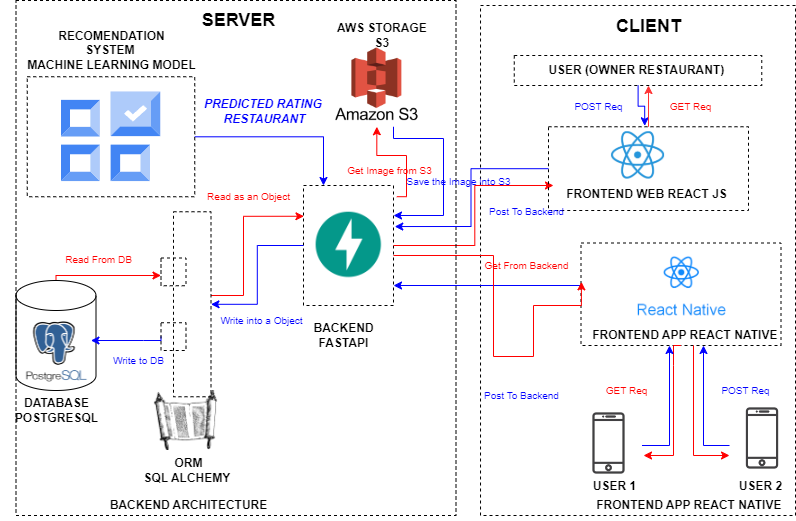

# Web Service and  Application for Restaurants Owners. Recommendation System

## Full Stack web service application with NextJS,FastApi and PostgresSQL.
## Full Stack React Native Application UI

### Recommendation System (Collaborative Filtering).

**Rating Recommendation Filtering System using Collaborative Filtering Algorithm, the rating of a menu in each 
restaurant is made by the user of the restaurant.**

### DataBase

**For the database PostgresSQL was choosen as a main database for his simplicity and standard use across academy and real life business. Also it was decided to use  SQLAlchemy as an ORM framework that helps to manage queries of the database in a much efficient way**

### Frontend 
**For the frontend it was choosen React and NextJS as a main framework due his capability of Server Side Rendering and Client Side Rendering , making the rendering process of web pages that are constantly changing data much easier**

### Backend 
**For the backend it was used FastApi because of his flexibility when it comes to create fast APIs endpoints and his vast documentations that makes the design process faster and efficient**

### From where it comes the idea of this service 

**Mainly to help small bussiness that want to take advantage of forecasting methods that are already used by big companies but they do not have the money or knowledge to use such technologies**

### Architecture

### How to run it 

### Backend
- **Create your python environment (venv)**.
- **Run pip install -r requirements.txt**.
- **Run python/app.py inside backend folder**.
- **Run backend server on port 8000**.

### Frontend 
- **Run yarn install**.
- **Run yarn dev**.
- **Run website on port 3000**.

